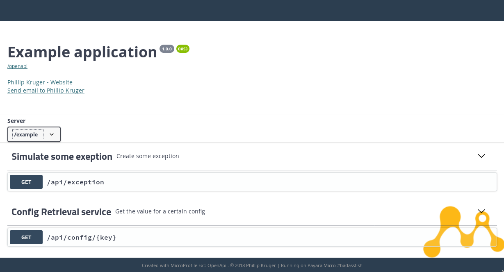
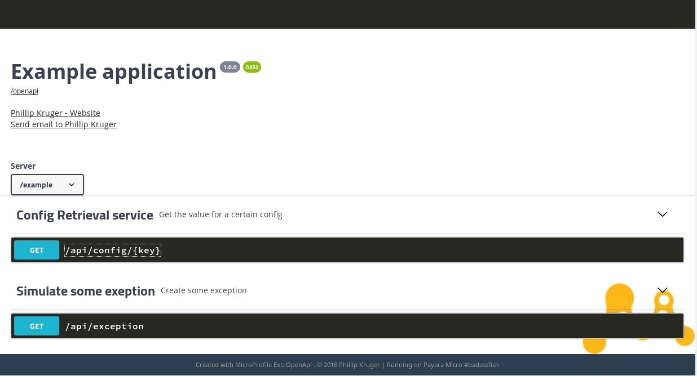

# OpenApi Extensions | Swagger UI

This library adds Swagger UI to MicroProfile OpenAPI.

Read more about OpenAPI here: 

* [Specification](http://download.eclipse.org/microprofile/microprofile-open-api-1.0/microprofile-openapi-spec.html)
* [Github](https://github.com/eclipse/microprofile-open-api)

## Getting started

In your ```pom.xml```:

```xml

    <dependency>
        <groupId>org.microprofile-ext.openapi-ext</groupId>
        <artifactId>swagger-ui</artifactId>
        <version>XXXX</version>
    </dependency>
```

This will pull in Swagger UI via [webjars](http://webjars.org/) and generate the ```index.html``` from a template that you can configure using [MicroProfile Config API](https://github.com/eclipse/microprofile-config).

Just adding the above will already give you the default UI, example:

http://localhost:8080/example/api/openapi-ui/


## Personalize your UI

Using the Config API you can Personalize the UI. Here are the config keys you can use:

* **openapi-ui.copyrightBy** - Adds a name to the copyright in the footer. Defaults to none.
* **openapi-ui.copyrightYear** - Adds the copyright year. Defaults to current year.
* **openapi-ui.title** - Adds the title in the window. Defaults to "MicroProfile - Open API".
* **openapi-ui.serverInfo** - Adds info on the server. Defaults to the system server info.
* **openapi-ui.contextRoot** - Adds the context root. Defaults to the current value.
* **openapi-ui.swaggerUiTheme** - Use a theme from swagger-ui-themes. Defaults to "flattop".
* **openapi-ui.swaggerHeaderVisibility** - Show/hide the swagger logo header. Defaults to "visible".
* **openapi-ui.exploreFormVisibility** - Show/hide the explore form. Defaults to "hidden".
* **openapi-ui.serverVisibility** - Show/hide the server selection. Defaults to "hidden".
* **openapi-ui.createdWithVisibility** - Show/hide the created with footer. Defaults to "visible".

Example: Adding this to ```META-INF/microprofile.properties```

```

    openapi-ui.copyrightBy=Phillip Kruger
    openapi-ui.title=My awesome services
    openapi-ui.swaggerHeaderVisibility=hidden
    openapi-ui.serverVisibility=visible
```

will change the UI:



### Theme

The default UI uses the flattop theme from [swagger-ui-themes](http://meostrander.com/swagger-ui-themes/), but you can also change that:

```

    openapi-ui.swaggerUiTheme=monokai
```



### Logo

Lastly, you can change the logo to your company logo by including a file named ```openapi.png``` in ```/src/main/resources/```:

